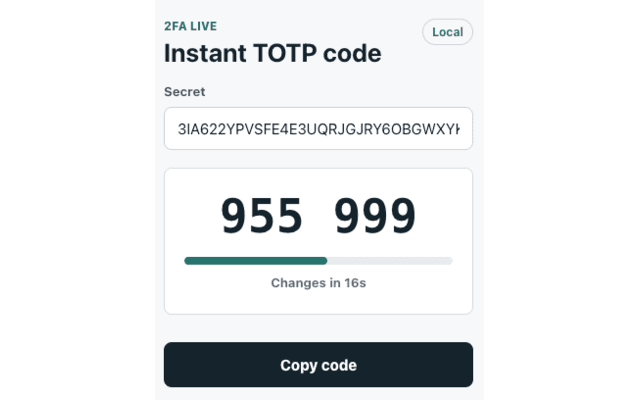

# 2FA Live

<p align="center">
  
</p>

Open-source browser extension for showing a TOTP 2FA code instantly from a shared secret.



## Features

- Generates 6-digit TOTP codes locally in the popup.
- Updates automatically when the current code expires.
- Shows the countdown to the next code.
- Copies the current code with one click.
- Does not send secrets anywhere.

## Secret Format

Paste the Base32 secret provided by your service, usually from an authenticator setup screen. Spaces are ignored.

You can also paste an `otpauth://totp/...` URL. 2FA Live extracts the `secret` value and uses the URL's `period` value when present.

## Author

Trang Ha Viet

## Source code

https://github.com/tranghaviet/2fa-live

## Development

```bash
npm install
npm run dev
```

For Chrome/Chromium development, open `chrome://extensions`, enable Developer mode, and load the generated extension from the Vite/CRXJS development output.

Build a production extension:

```bash
npm run build
```

The packaged extension files are emitted to `dist`.

Package a Chrome-ready zip:

```bash
npm run pack:extension
```

The command regenerates the extension icons, builds `dist`, and creates `2fa-live-0.1.0.zip` with `manifest.json` at the archive root.
